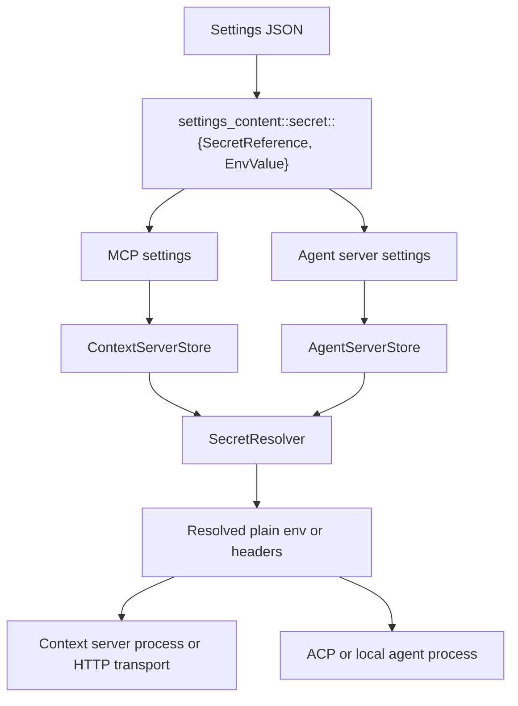
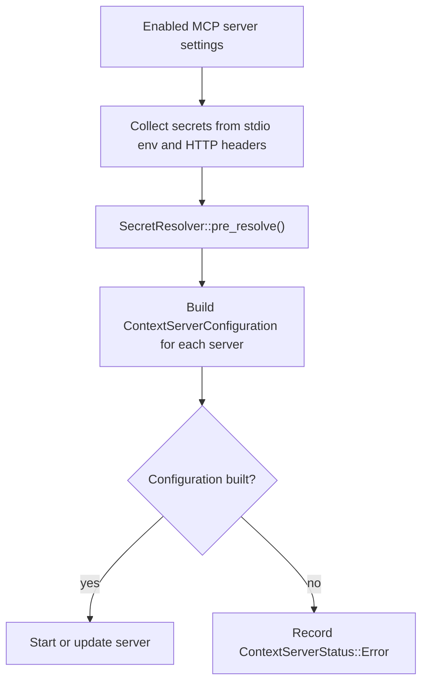
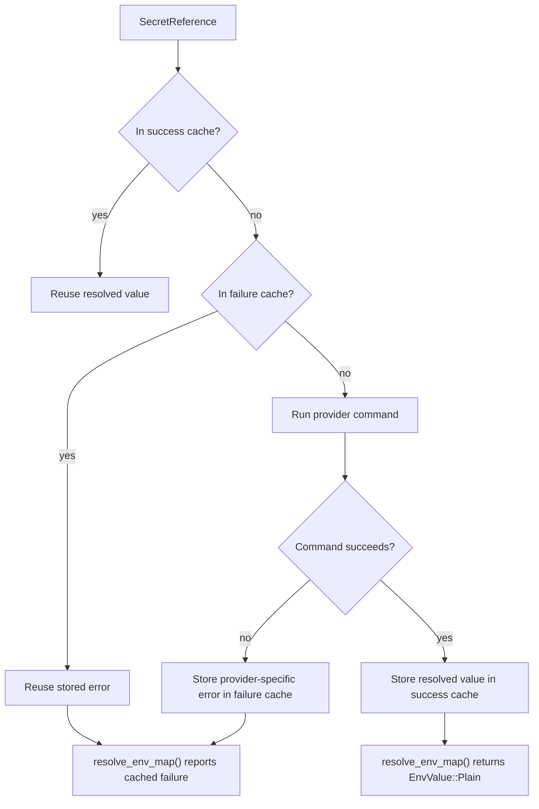

# Secret-Aware Settings Values

## Summary

A shared secret-aware string value carries credential-bearing settings that need either plain text or a reference to an
external secret provider. The shared model is used by:

- MCP context server stdio environment variables
- MCP context server HTTP headers
- Custom agent server environment variables

## Supported Configuration

Plain values still work:

```json
{
  "context_servers": {
    "github-mcp": {
      "command": "mcp-server-github",
      "env": {
        "GITHUB_TOKEN": "plain-token"
      }
    }
  },
  "agent": {
    "servers": {
      "custom": {
        "type": "custom",
        "command": "my-agent",
        "env": {
          "API_KEY": "plain-token"
        }
      }
    }
  }
}
```

Secret references use a tagged object:

```json
{
  "context_servers": {
    "github-mcp": {
      "command": "mcp-server-github",
      "env": {
        "GITHUB_TOKEN": {
          "$secret": {
            "provider": "1password",
            "reference": "op://vault/github/token"
          }
        }
      }
    }
  },
  "agent": {
    "servers": {
      "custom": {
        "type": "custom",
        "command": "my-agent",
        "env": {
          "OPENAI_API_KEY": {
            "$secret": {
              "provider": "command",
              "reference": "echo $OPENAI_API_KEY"
            }
          }
        }
      }
    }
  }
}
```

The same `EnvValue` format is also supported in MCP HTTP headers when those headers carry tokens or other credentials.

Platform note:

- On Unix-like systems, the `command` provider runs through `sh -c`
- On Windows, the `command` provider runs through PowerShell Core via `pwsh -NoLogo -NoProfile -NonInteractive -Command`
- `1password` is supported on Windows through the `op` CLI
- `pass` is a Unix-oriented provider and is not supported on Windows

## Shared Types

The shared types live in `crates/settings_content/src/secret.rs` and are re-exported through `settings_content`:

- `SecretReference`
- `EnvValue`

`EnvValue` is an untagged enum:

- `Plain(String)`
- `Secret { "$secret": SecretReference }`

Helper methods on `EnvValue`:

- `as_plain()`
- `as_secret()`
- `into_plain_string()`

`ContextServerCommand.env` and `AgentServerCommand.env` both carry `HashMap<String, EnvValue>` internally. Their debug
output redacts secret references as `[SECRET]`.



## Current Scope

The implementation is generalized at the settings-value level for credential-bearing fields, not at the level of every
possible configuration string.

This is the intended scope. Secret references are meant for values such as:

- API keys
- access tokens
- bearer tokens
- client secrets
- passwords
- auth-related env variables
- auth-related HTTP headers

They are not meant to become a generic wrapper for ordinary settings such as:

- file paths
- binary paths
- URLs
- model names
- server names
- ordinary command arguments

Wired subsystems:

- MCP stdio environment variables
- MCP HTTP headers
- Custom agent server env for custom agents
- Custom agent server env for extension-provided local agents
- Custom agent server env for registry-provided local agents

Future candidates:

- LSP binary env
- DAP env
- Arbitrary non-env string settings

The last item is intentionally out of scope. The repeated problem is "credential-bearing configuration values,
especially in env maps and auth headers", not "all strings everywhere".

## Resolution Flow

There is one shared resolver implementation in `crates/project/src/secret_resolver.rs`, but resolution still happens per
subsystem.

### MCP context servers

Runtime flow:

`settings` -> `ContextServerSettings` -> `ContextServerConfiguration::from_settings()` -> `ContextServer`

Before building enabled servers, `maintain_servers()`:

1. Collects secret references from stdio env maps and HTTP headers
2. Calls `pre_resolve()` sequentially
3. Builds every enabled server configuration
4. Surfaces per-server failures as configuration errors instead of dropping the server

Sequential pre-resolution is intentional so providers like 1Password can reuse an authenticated session after the first
biometric prompt.



### Agent servers

Agent server settings use the same `EnvValue` model for credential-bearing env entries, but resolution happens when
constructing launch commands rather than in a global pre-resolution pass.

Runtime flow:

`settings` -> `AgentServerStore` -> launch command construction -> ACP/local agent launch

At command construction time:

1. Secret references are collected from the configured env map
2. `SecretResolver::pre_resolve()` resolves those references
3. The final process environment is converted to plain `HashMap<String, String>`
4. Plain values are wrapped back into `EnvValue::Plain` only where an internal command/proto boundary still expects
   `EnvValue`

This keeps secret references in settings and internal configuration objects for credential-bearing env entries, but
plain strings at actual process-spawn boundaries.

## SecretResolver Behavior

`SecretResolver` keeps:

- A cache of successfully resolved secrets
- A cache of resolution failures keyed by `SecretReference`

`SecretResolver` behavior:

- `pre_resolve()` does not stop at the first bad secret
- Successful secrets are cached even when other references fail
- Failed secrets retain their provider-specific error
- `resolve_env_map()` reports the cached failure for any unresolved secret entry

This prevents one broken secret from blocking unrelated secret-backed servers.



### Provider dispatch

| Provider                    | Command                                                        |
| --------------------------- | -------------------------------------------------------------- |
| `1password`                 | `op read <reference>`                                          |
| `pass` on Unix-like systems | `pass show <reference>`                                        |
| `pass` on Windows           | unsupported                                                    |
| `command` on Unix           | `sh -c <reference>`                                            |
| `command` on Windows        | `pwsh -NoLogo -NoProfile -NonInteractive -Command <reference>` |

## Error Handling

### MCP failures

MCP configuration failures from secret resolution are surfaced as `ContextServerStatus::Error`.

Behavior in `crates/project/src/context_server_store.rs`:

- `ContextServerConfiguration::from_settings()` returns `Result<Self>`
- Secret resolution and extension command failures propagate as configuration errors
- `maintain_servers()` separates successful configurations from per-server failures
- Configured servers remain visible in the UI instead of being treated as removed

This keeps a transient secret error from making a configured server disappear as if the user had deleted it.

### Agent server boundaries

ACP and process-spawn code paths only receive plain env values.

Boundary behavior:

- `AgentServerStore` resolves settings env before spawning local agents
- `crates/agent_servers/src/acp.rs` forwards only plain env entries to ACP
- unresolved secret references fail command construction instead of silently leaking through to the runtime boundary

## Boundary Updates

The following integration points carry `EnvValue` internally while preserving plain-string runtime boundaries:

- `crates/settings_content/src/secret.rs` defines `SecretReference` and `EnvValue`
- `crates/settings_content/src/project.rs` uses shared `EnvValue` for MCP env and HTTP headers
- `crates/settings_content/src/agent.rs` uses shared `EnvValue` for custom agent server env
- `crates/project/src/secret_resolver.rs` resolves secret references with cached successes and failures
- `crates/project/src/context_server_store.rs` resolves MCP secrets and surfaces per-server configuration failures
- `crates/project/src/agent_server_store.rs` resolves agent env secrets before local launch
- `crates/context_server/src/context_server.rs` converts MCP env to plain strings for `ModelContextServerBinary`
- `crates/project/src/context_server_store/extension.rs` wraps extension-provided MCP env values in `EnvValue::Plain`
- `crates/settings/src/vscode_import.rs` wraps imported plain env values in `EnvValue::Plain`
- `crates/extension_host/src/wasm_host/wit/since_v0_8_0.rs` converts values back to plain strings for extension export
- `crates/agent_servers/src/acp.rs` filters env values to plain strings before launching ACP-backed processes
- `crates/agent_ui/src/agent_configuration/configure_context_server_modal.rs` accepts and reserializes `EnvValue` in the
  MCP editor UI

## Verification

Verification commands:

1. `cargo test -p project --features test-support --test integration context_server_store -- --nocapture`
2. `cargo test -p project --features test-support --test integration extension_agent_tests::test_tilde_expansion_in_settings -- --nocapture`
3. `cargo check -p settings_content -p settings -p project -p agent_servers -p agent_ui -p context_server`

The added tests cover:

- Continuing to resolve independent secrets after one secret fails
- Keeping a configured MCP server in `Error` rather than letting it disappear
- Preserving secret-valued agent env entries through settings conversion
